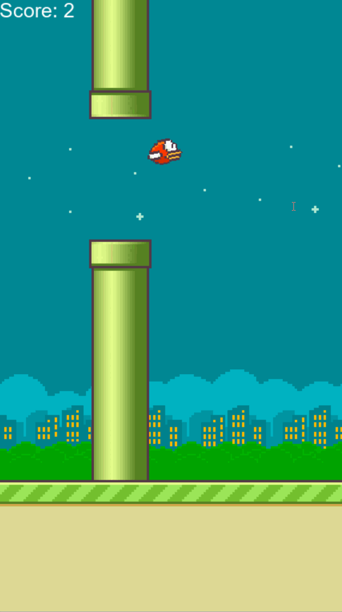
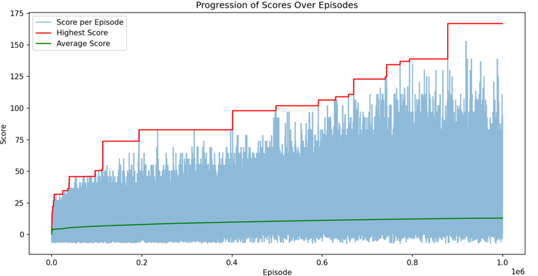
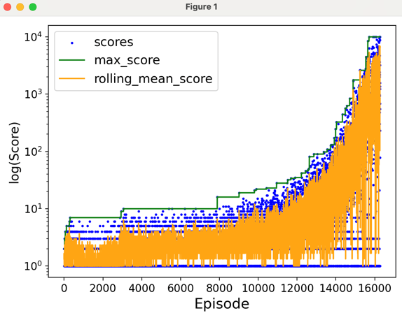
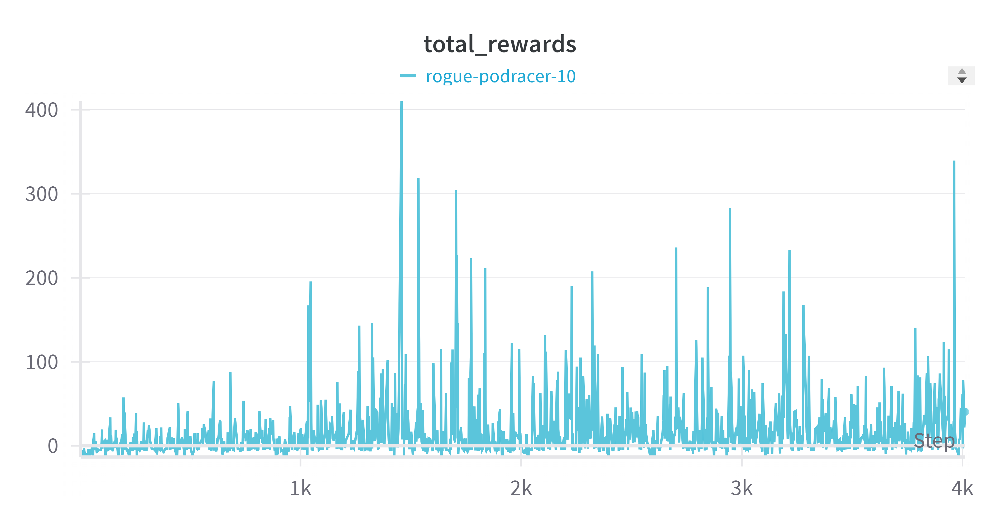
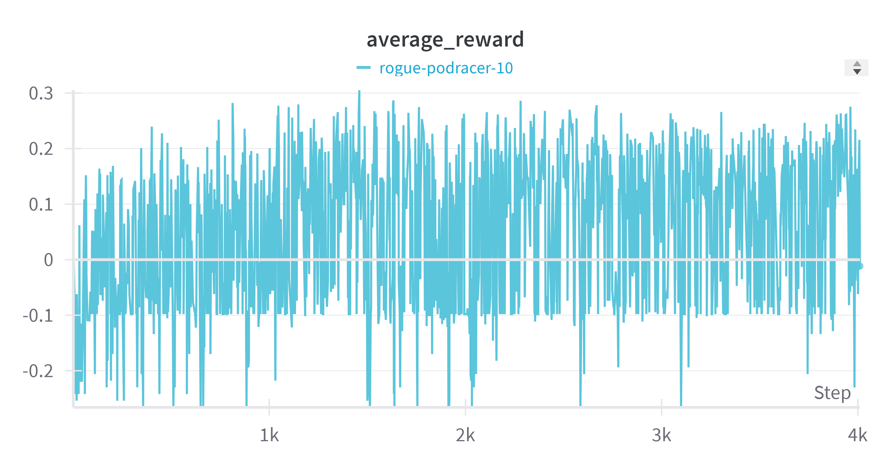

# CS5804: A Reinforcement Learning Approach to Mastering Flappy-Bird

### Team: Kevin Lizarazu, Devashree Bhagwat, Inseong Lee, Sai Siri Chandana Namala

## Problem Statement
This project uses artificial intelligence (AI) methods to train an intelligent agent to master the gameplay of Flappy Bird, a notoriously challenging arcade-style game. Flappy Bird presents a dynamic environment where the player, represented by a bird, must navigate through a series of pipes by flapping its wings to avoid collision. The key challenges lie in understanding the game dynamics, making real-time decisions to overcome obstacles, and achieving a high score. We plan to employ a combination of deep learning and reinforcement learning techniques to address this problem and determine which method delivers the best results.

Assets for the game derived from [here](https://github.com/samuelcust/flappy-bird-assets)

<br>
<div style="text-align:center">
  
</div>

## Project Setup

In the root directory, install all the required dependencies
```
pip install -r requirements.txt
```

## Algorithms

Our goals are:
- maximize player
- avoid collisions

To achieve these goals we plan on using model-free Reinforcement Learning (RL) algorithms.

### State-Action-Reward-State-Action (SARSA)

Is an on-policy algorithm that utilizes current state, action, and reward values along with the next state and action values to calculate a Q-value and update weights on the Q-table.



To train this model:
```
python main.py --mode sarsa --train
```
To run a trained model:
```
python main.py --mode sarsa --run
```

### Q-Learning

Offline planning algorithm takes current state information to select the next action that will result in the highest quality (Q) value for the next state. Variables like epsilon help the player explore its environment and gamma controls how effective future rewards will be.



To train this model:
```
python main.py --mode qlearning --train
```
To run a trained model:
```
python main.py --mode qlearning --run
```

### Deep Q Network (DQN)

Deep Q-Network is a neural network architecture that is proved to be a better implementation than Q-Learning when the input has high dimensionality. Since sampling every pixel or every feature is unrealistic, our input state space will contain select features to store and sample from for experience replay.




To train this model:
```
python main.py --mode dqn --train
```
To run a trained model:
```
python main.py --mode dqn --run
```

### Manual Game Mode

A custom game environment was created to replicate the Flappy Bird game, you can play this game by simply setting the mode as 'manual'. Each run is recorded and has the ability to replay the past manual game run. All configurations are found on _config.json_

To play the manual game:
```
python main.py --mode manual
```
To replay last manual game:
```
python main.py --mode replay